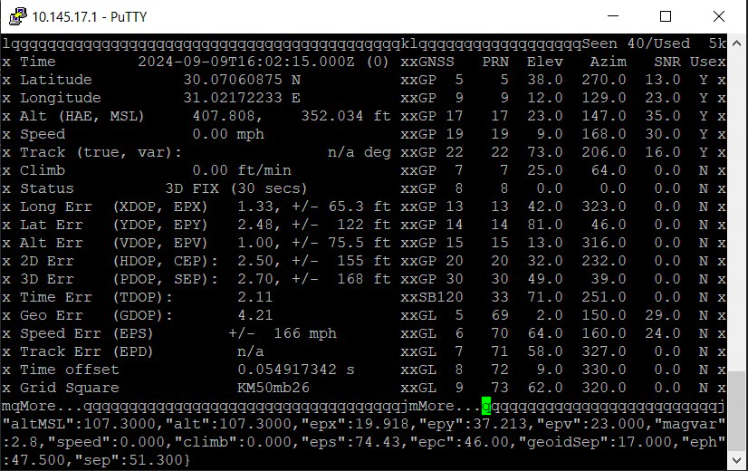
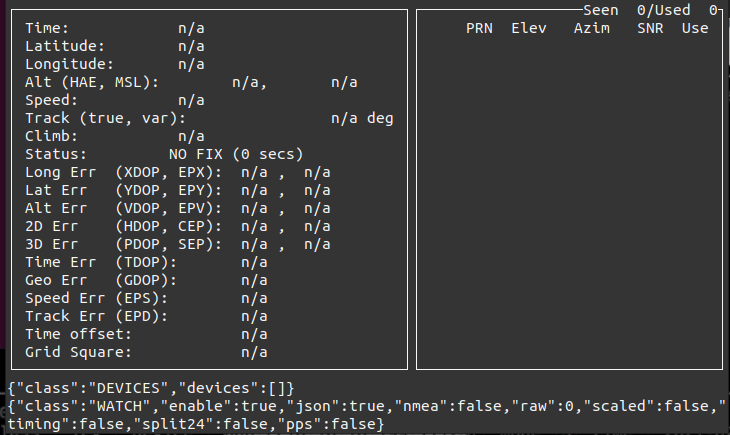

# How to get the GPS data off from your Phone and to Raspberry pi 

Being able to stream GPS data from your mobile device has a number of benefits. Firstly, the GPS on your phone is usually locked onto the satellites, so you don't have to wait for it to lock onto the satellites before you can start streaming high-quality data to your pi. Secondly, your gps in your mobile device is far superior to the cheap little usb gps devices that i have been buying 

## Start taking a look at you are going to need 

1. an app on your mobile phone in order to make this work 

[Android App](https://f-droid.org/packages/io.github.tiagoshibata.gpsdclient/)

## for the android devices 

- GPSD Forwarder: This application forwards NMEA data from your phone's GPS to a specified host. Data is forwarded using UDP.

1. put the PI ip address in the first box
2. put the port number in the second box (from QRcode in app)
3. click start 


## let's go to the Pi

1. open terminal window  
2. make sure the Pi and phone is on the same network: you can connect those both to the same Wifi router
3. to see the stream data 

```sh 

cgps
```



4. we need to stop what is currently running 

```sh
sudo systemctl stop gpsd 
```

```sh 
Warning: Stopping gpsd.service, but it can still be activated by: gpsd.socket
```

```sh
sudo systemctl stop gpsd.socket
```

- that takes care of stopping every thing that was running in the background 

```sh
cgps
```

```sh
cgps: no gpsd running or network error: -6, can't connect to hostlport pair 
```

5. establish the connection between our Raspberry Pi and our phone

```sh 

 # To know the ip address of Pi 
 ifconfig 
 # OR
 hostname -I
```
6.  

```sh 
gpsd -N udp:://<Pi ip address>:<port number>
```

now the application is Running 

7. open another terminal and run cgps
 
```sh 
cgps
```

Now we streaming mobile data 


#  To automate The process and parse data 

- write a bash script:
  
This script sets up a GPS data logging system that:
Connects to a GPS source via a UDP stream.
Logs the latest speed and location data every 5 seconds.
Writes the speed to a specific file (speed.txt) and the location (latitude and longitude) to another file (location.txt).
